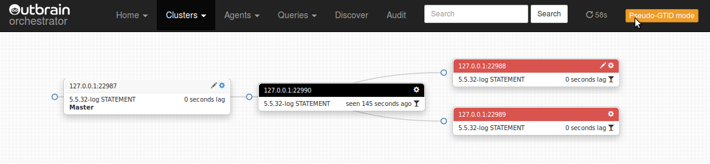
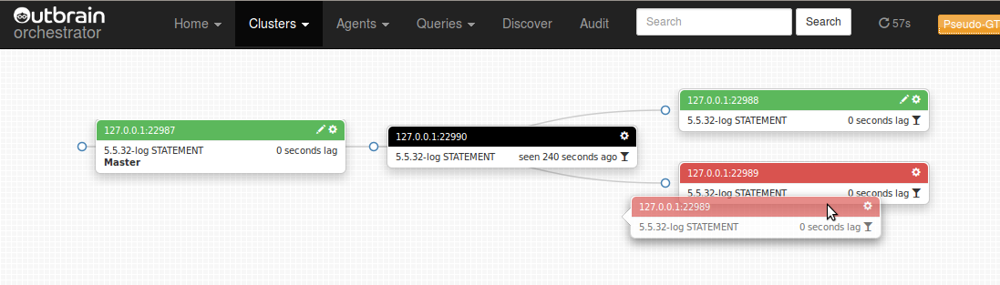
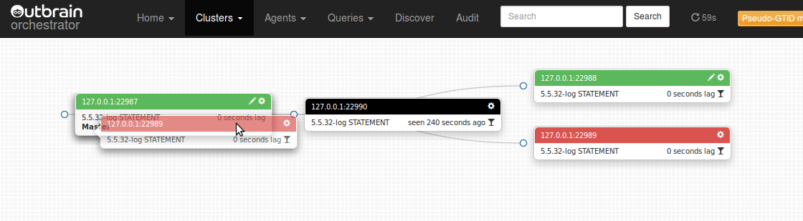
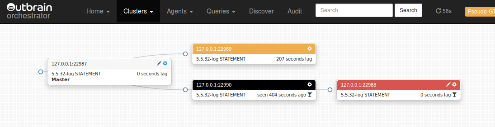

## About

_Orchestrator_ is a MySQL replication topology management and visualization tool, allowing for:

* Detection and interrogation of replication clusters
* Safe topology refactoring: moving slaves around the topology
* Fail over and rematching of slaves even as master or local masters are inaccessible (via Pseudo GTID)
* Sleek topology visualization
* Replication problems visualization
* Topology changes via intuitive drag & drop
* Maintenance mode declaration and enforcement
* Reviewing and killing long running queries
* Auditing of operations
* When working with [orchestrator-agent](https://github.com/outbrain/orchestrator-agent), seed new/corrupt instances
* More...

Refactoring the topology is a matter of a simple drag & drop. _Orchestrator_ will keep you safe by disallowing invalid replication topologies
(e.g. replicating from ROW based to STATEMENT based, from 5.5 to 5.1 etc.)

_Orchestrator_ is developed at [Outbrain](http://www.outbrain.com/) to answer for the difficulty in managing replication topologies.
At the time of _orchestrator_ creation GTID is available via MySQL 5.6 and MariaDB 10.0. And yet GTID is still not as mature as one would hope for.
The majority of users still use plain-old binlog file:position based MySQL replication, and apparently this will hold for some time.


#### TOC

- [About](#about)
- [License](#license)
- [Download](#download)
- [Requirements](#requirements)
- [Installation](#installation)
- [Execution](#execution)
- [Using the Web interface](#using-the-web-interface)
- [Using the web API](#using-the-web-api)
- [Security](#security)
- [Configuration](#configuration)
- [Supported topologies](#supported-topologies)
- [Pseudo GTID](#pseudo-gtid)
- [Agents](#agents)
- [Risks](#risks)
- [Gotchas](#gotchas)
- [Bugs](#bugs)
- [Contributions](#contributions)


## License
_Orchestrator_ is released as open source under the [Apache 2.0 license](http://www.apache.org/licenses/LICENSE-2.0)


## Download
_Orchestrator_ is released as open source and is available at [GitHub](https://github.com/outbrain/orchestrator).
Find official releases in https://github.com/outbrain/orchestrator/releases


## Requirements
_Orchestrator_ is a standalone Go application. It requires a MySQL backend to store topologies state, maintenance status and audit history.
It is built and tested on Linux 64bit, and binaries are availably for this OS type alone. The author has not tested any other operating system,
though any other unix-like OS should do just fine.


## Installation
The following assumes you will be using the same machine for both the _orchestrator_ binary and the MySQL backend.
If not, replace `127.0.0.1` with appropriate host name. Replace `orch_backend_password` with your own super secret password.


#### Setup backend MySQL server

Setup a MySQL server for backend, and invoke the following:

    CREATE DATABASE IF NOT EXISTS orchestrator;
    GRANT ALL PRIVILEGES ON `orchestrator`.* TO 'orchestrator'@'127.0.0.1' IDENTIFIED BY 'orch_backend_password';

_Orchestrator_ uses a configuration file, located in either `/etc/orchestrator.conf.json` or relative path to binary `conf/orchestrator.conf.json` or
`orchestrator.conf.json`. Edit this file to match the above as follows:

    ...
    "MySQLOrchestratorHost": "127.0.0.1",
    "MySQLOrchestratorPort": 3306,
    "MySQLOrchestratorDatabase": "orchestrator",
    "MySQLOrchestratorUser": "orchestrator",
    "MySQLOrchestratorPassword": "orch_backend_password",
    ...


#### Grant access to orchestrator on all your MySQL servers
For _orchestrator_ to detect your replication topologies, it must also have an account on each and every topology. At this stage this has to be the
same account (same user, same password) for all topologies. On each of your masters, issue the following:

    GRANT SUPER, PROCESS, REPLICATION SLAVE ON *.* TO 'orchestrator'@'orch_host' IDENTIFIED BY 'orch_topology_password';

> REPLICATION SLAVE is required if you intend to use [Pseudo GTID](#pseudo-gtid)

Replace `orch_host` with hostname or orchestrator machine (or do your wildcards thing). Choose your password wisely. Edit `orchestrator.conf.json` to match:

    "MySQLTopologyUser": "orchestrator",
    "MySQLTopologyPassword": "orch_topology_password",


#### Extract orchestrator binary and files

- Extract from tarball

  Extract the archive you've downloaded from https://github.com/outbrain/orchestrator/releases
  For example, let's assume you wish to install _orchestrator_ under `/usr/local/orchestrator`:

      sudo mkdir -p /usr/local
      sudo cd /usr/local
      sudo tar xzfv orchestrator-1.0.tar.gz

- Install from `RPM`

  Installs onto `/usr/local/orchestrator`. Execute:

      sudo rpm -i orchestrator-1.0-1.x86_64.rpm


- Install from `DEB`

  Installs onto `/usr/local/orchestrator`. Execute:

      sudo dpkg -i orchestrator_1.0_amd64.deb

Consider moving `conf/orchestrator.conf.json` to `/etc/orchestrator.conf.json` (both locations are valid)

To execute _orchestrator_ in command line mode or in HTTP API only, all you need is the `orchestrator` binary.
To enjoy the rich web interface, including topology visualizations and drag-and-drop topology changes, you will need
the `resources` directory and all that is underneath it. If you're unsure, don't touch; things are already in place.


## Execution


#### Executing as web/API service

Assuming you've installed _orchestrator_ under `/usr/local/orchestrator`:

    cd /usr/local/orchestrator && ./orchestrator http

_Orchestrator_ will start listening on port `3000`. Point your browser to `http://your.host:3000/`
and you're ready to go. You may skip to next sections.

If you like your debug messages, issue:

    cd /usr/local/orchestrator && ./orchestrator --debug http

or, even more detailed in case of error:

    cd /usr/local/orchestrator && ./orchestrator --debug --stack http

The above looks for configuration in `/etc/orchestrator.conf.json`, `conf/orchestrator.conf.json`, `orchestrator.conf.json`, in that order.
Classic is to put configuration in `/etc/orchestrator.conf.json`. Since it contains credentials to your MySQL servers you may wish to limit access to that file.
You may choose to use a different location for the configuration file, in which case execute:

    cd /usr/local/orchestrator && ./orchestrator --debug --config=/path/to/config.file http

Web/API service will, by default, issue a continuous, infinite polling of all known servers. This keeps _orchestrator_'s data up to date.
You typically want this behavior, but you may disable it, making _orchestrator_ just serve API/Web but never update the instances status:

    cd /usr/local/orchestrator && ./orchestrator --discovery=false http

The above is useful for development and testing purposes. You probably wish to keep to the defaults.


#### Executing as command line

Following is a synopsis of command line samples. For simplicitly, we assume `orchestrator` is in your path.
If not, replace `orchestrator` with `/path/to/orchestrator`.

> Samples below use a test `mysqlsandbox` topology, where all instances are on same host `127.0.0.1` and on different ports. `22987` is master,
> and `22988`, `22989`, `22990` are slaves.

Show currently known clusters (replication topologies):

    orchestrator -c clusters cli

> The above looks for configuration in `/etc/orchestrator.conf.json`, `conf/orchestrator.conf.json`, `orchestrator.conf.json`, in that order.
> Classic is to put configuration in `/etc/orchestrator.conf.json`. Since it contains credentials to your MySQL servers you may wish to limit access to that file.

You may choose to use a different location for the configuration file, in which case execute:

    orchestrator -c clusters --config=/path/to/config.file cli

> `-c` stands for `command`, and is mandatory.

Discover a new instance ("teach" _orchestrator_ about your topology). _Orchestrator_ will automatically recursively drill up the master chain (if any)
and down the slaves chain (if any) to detect the entire topology:

    orchestrator -c discover -i 127.0.0.1:22987 cli

> `-i` stands for `instance` and must be in the form `hostname:port`.

Do the same, and be more verbose:

    orchestrator -c discover -i 127.0.0.1:22987 --debug cli
    orchestrator -c discover -i 127.0.0.1:22987 --debug --stack cli

> `--debug` can be useful in all operations. `--stack` prints code stack trace on (most) errors and is useful
> for development & testing purposed or for submitting bug reports.

Forget an instance (an instance may be manually or automatically re-discovered via `discover` command above):

    orchestrator -c forget -i 127.0.0.1:22987 cli

Print an ASCII tree of topology instances. Pass a cluster name via `-i` (see `clusters` command above):

    orchestrator -c topology -i 127.0.0.1:22987 cli

> Sample output:
>
>     127.0.0.1:22987
>     + 127.0.0.1:22989
>       + 127.0.0.1:22988
>     + 127.0.0.1:22990

Move a slave up the topology (make it sbling of its master, or direct slave of its "grandparent"):

    orchestrator -c move-up -i 127.0.0.1:22988 cli

> The above command will only succeed if the instance _has_ a grandparent, and does not have _problems_ such as slave lag etc.

Move a slave below its sibling:

    orchestrator -c move-below -i 127.0.0.1:22988 -s 127.0.0.1:22990 --debug cli

> `-s` stands for `sibling`.

> The above command will only succeed if `127.0.0.1:22988` and `127.0.0.1:22990` are siblings (slaves of same master), none of them has _problems_ (e.g. slave lag),
> and the sibling _can_ be master of instance (i.e. has binary logs, has `log_slave_updates`, no version collision etc.)

Promote a slave to be co-master with its master, making for a circular Master-Master topology:

    orchestrator -c make-co-master -i 127.0.0.1:22988 cli

> The above command will only succeed if `127.0.0.1:22988`'s master is root of topology (is not itself a slave)
> and is not associated in another co-master ring.

Reset a slave, effectively breaking down the replication (destructive action):

    orchestrator -c reset-slave -i 127.0.0.1:22988 cli

> *A note on topology refactoring commands*
>
> `move-up`, `move-below`, `make-co-master` and `reset-slave` are the building blocks of _classic_ topology refactoring.
> With the first two actions one can make any change to the topology, with the exception of moving the master.
> The last two allow replacing a master by promoting one of its slaves to be a co-master (MySQL master-master
> replication), then resetting the newly promoted co-master, effectively making it the master of all topology.

> These actions are also as atomic as possible, by only affecting two replication servers per action (e.g. `move-up` affects
> the instance and its master; `move-below` affect the instance and its sibling).

> The word _classic_ relates to the method of using an up-and-alive topology, where all connections are good and
> instances can be queried for their replication status.

> In such a case _orchestrator_ does not and will not support complex changes (like arbitrarily moving a slave to another position)
> since this would require affecting multiple servers, increasing the chance for something to go wrong or for the
> total operation time to become prohibitively high without the DBA having a chance to get involved.
> Our experience is that by working out these atomic operations the DBA is more in control of potential problems.
> We also observed that it takes little extra time to initiate such multiple steps.

> However _orchestrator_ also supports topology refactoring in situations where servers are inaccessible,
> via Pseudo GTID technology. It may allow promoting a slave up the topology even as its master is dead, or
> matching and synching the slaves of a failed master even though they all stopped replicating in different
> positions. In such case a more relaxed method of movingthe slave is provided, called "_matching_".

Match a slave below another instance (we expect the other instance to be as advanced or more advanced than the moved slave)

    orchestrator -c match-below -i 127.0.0.1:22988 -s 127.0.0.1:22990 --debug cli

> The above required Pseudo GTID to be present and configured. It may take more time to execute as it needs to
> look up entires in the servers binary log.
> See [Pseudo GTID](#pseudo-gtid) for more details.

Make an instance read-only or writeable:

    orchestrator -c set-read-only -i 127.0.0.1:22988 cli
    orchestrator -c set-writeable -i 127.0.0.1:22988 cli

Begin maintenance mode on an instance. While in maintenance mode, _orchestrator_ will not allow this instance to
be moved or participate in another instance's move:

    orchestrator -c begin-maintenance -i 127.0.0.1:22988 cli

End maintenance mode on an instance:

    orchestrator -c end-maintenance -i 127.0.0.1:22988 cli

Make an infinite, continuous discovery and investigation of known instances. Typically this is what the web service executes.

    orchestrator -c continuous --debug cli

Just check if an instance can be connected: attempt to resolve hostname and make a TCP connection to host & port:

    orchestrator -c resolve -i myhost.mydomain:3306

Complete orchestrator CLI documentation

```
orchestrator [-c command] [-i instance] [--verbose|--debug] [... cli ] | http

Cheatsheet:
	Run orchestrator in HTTP mode:

	orchestrator --debug http

	For CLI executuon see details below.

-i (instance):
	instance on which to operate, in "hostname" or "hostname:port" format.
	Default port is 3306 (or DefaultInstancePort in config)
	For some commands this argument can be ommitted altogether, and the
	value is implicitly the local hostname.
-s (Sibling/Subinstance/deStination)
	associated instance. Meaning depends on specific command.

-c (command):
	Listed below are all available commands; all of which apply for CLI execution (ignored by HTTP mode).
	Different flags are required for different commands; see specific documentation per commmand.

	Topology refactoring using classic MySQL replication commands
		(ie STOP SLAVE; START SLAVE UNTIL; CHANGE MASTER TO; ...)
		These commands require connected topology: slaves that are up and running; a lagging, stopped or
		failed slave will disable use of most these commands. At least one, and typically two or more slaves
		will be stopped for a short time during these operations.

		move-up
			Move a slave one level up the topology; makes it replicate from its grandparent and become sibling of
			its parent. It is OK if the instance's master is not replicating. Examples:

			orchestrator -c move-up -i slave.to.move.up.com:3306

			orchestrator -c move-up
				-i not given, implicitly assumed local hostname

		move-up-slaves
			Moves slaves of the given instance one level up the topology, making them siblings of given instance.
			This is a (faster) shortcut to executing move-up on all slaves of given instance.
			Example:

			orchestrator -c move-up-slaves -i slave.whose.subslaves.will.move.up.com[:3306]

		move-below
			Moves a slave beneath its sibling. Both slaves must be actively replicating from same master.
			The sibling will become instance's master. No action taken when sibling cannot act as master
			(e.g. has no binary logs, is of incompatible version, incompatible binlog format etc.)
			Example:

			orchestrator -c move-below -i slave.to.move.com -s sibling.slave.under.which.to.move.com

			orchestrator -c move-below -s sibling.slave.under.which.to.move.com
				-i not given, implicitly assumed local hostname

		enslave-siblings
			Turn all siblings of a slave into its sub-slaves. No action taken for siblings that cannot become
			slaves of given instance (e.g. incompatible versions, binlog format etc.). This is a (faster) shortcut
			to executing move-below for all siblings of the given instance. Example:

			orchestrator -c enslave-siblings -i slave.whose.siblings.will.move.below.com

		repoint
			Make the given instance replicate from another instance without changing the binglog coordinates. There
			are little sanity checks to this and this is a risky operation. Use cases are: a rename of the master's
			host, a corruption in relay-logs, move from beneath MaxScale & Binlog-server. Examples:

			orchestrator -c repoint -i slave.to.operate.on.com -s new.master.com

			orchestrator -c repoint -i slave.to.operate.on.com
				The above will repoint the slave back to its existing master without change

			orchestrator -c repoint
				-i not given, implicitly assumed local hostname

		make-co-master
			Create a master-master replication. Given instance is a slave which replicates directly from a master.
			The master is then turned to be a slave of the instance. The master is expected to not be a slave.
			The read_only property of the slve is unaffected by this operation. Examples:

			orchestrator -c make-co-master -i slave.to.turn.into.co.master.com

			orchestrator -c make-co-master
				-i not given, implicitly assumed local hostname

		get-candidate-slave
			Information command suggesting the most up-to-date slave of a given instance, which can be promoted
			as local master to its siblings. If replication is up and running, this command merely gives an
			estimate, since slaves advance and progress continuously in different pace. If all slaves of given
			instance have broken replication (e.g. because given instance is dead), then this command provides
			with a definitve candidate, which could act as a replace master. See also regroup-slaves. Example:

			orchestrator -c get-candidate-slave -i instance.with.slaves.one.of.which.may.be.candidate.com


	Topology refactoring using Pseudo-GTID
		These operations require that the topology's master is periodically injected with pseudo-GTID,
		and that the PseudoGTIDPattern configuration is setup accordingly. Also consider setting
		DetectPseudoGTIDQuery.
		Operations via Pseudo-GTID are typically slower, since they involve scanning of binary/relay logs.
		They impose less constraints on topology locations and affect less servers. Only servers that
		are being transported have their replication stopped. Their masters or destinations are unaffected.

		match-up
			Transport the slave one level up the hierarchy, making it child of its grandparent. This is
			similar in essence to move-up, only based on Pseudo-GTID. The master of the given instance
			does not need to be alive or connected (and could in fact be crashed). It is never contacted.
			Grandparent instance must be alive and accessible.
			Examples:

			orchestrator -c match-up -i slave.to.match.up.com:3306

			orchestrator -c match-up
				-i not given, implicitly assumed local hostname

		match-up-slaves
			Matches slaves of the given instance one level up the topology, making them siblings of given instance.
			This is a (faster) shortcut to executing match-up on all slaves of given instance. The instance need
			not be alive / accessib;e / functional. It can be crashed.
			Example:

			orchestrator -c match-up-slaves -i slave.whose.subslaves.will.match.up.com

		match-below
			Matches a slave beneath another (destination) instance. The choice of destination is almost arbitrary;
			it must not be a child/descendant of the instance. But otherwise they don't have to be direct siblings,
			and in fact (if you know what you're doing), they don't actually have to belong to the same topology.
			The operation expects the transported instance to be "behind" the destination instance. It only finds out
			whether this is the case by the end; the operation is cancelled in the event this is not the case.
			No action taken when destination instance cannot act as master (e.g. has no binary logs, is of incompatible version, incompatible binlog format etc.)
			Examples:

			orchestrator -c match-below -i slave.to.transport.com -s instance.that.becomes.its.master

			orchestrator -c match-below -s destination.instance.that.becomes.its.master
				-i not given, implicitly assumed local hostname

		multi-match-slaves
			Matches all slaves of a given instance under another (destination) instance. This is a (faster) shortcut
			to matching said slaves one by one under the destination instance. In fact, this bulk operation is highly
			optimized and can execute in orders of magnitue faster, depeding on the nu,ber of slaves involved and their
			respective position behind the instance (the more slaves, the more savings).
			The instance itself may be crashed or inaccessible. It is not contacted throughout the operation. Examples:

			orchestrator -c multi-match-slaves -i instance.whose.slaves.will.transport -s instance.that.becomes.their.master

		rematch
			Reconnect a slave onto its master, via PSeudo-GTID. The use case for this operation is a non-crash-safe
			replication configuration (e.g. MySQL 5.5) with sync_binlog=1 and log_slave_updates. This operation
			implies crash-safe-replication and makes it possible for the slave to reconnect. Example:

			orchestrator -c rematch -i slave.to.rematch.under.its.master

		regroup-slaves
			Given an instance (possibly a crashed one; it is never being accessed), pick one of its slave and make it
			local master of its siblings, using Pseudo-GTID. It is uncertain that there *is* a slave that will be able to
			become master to all its siblings. But if there is one, orchestrator will pick such one. There are many
			constraints, most notably the replication positions of all slaves, whether they use log_slave_updates, and
			otherwise version compatabilities etc.
			As many slaves that can be regrouped under promoted slves are operated on. The rest are untouched.
			This command is useful in the event of a crash. For example, in the event that a master dies, this operation
			can promote a candidate replacement and set up the remaining topology to correctly replicate from that
			replacement slave. Example:

			orchestrator -c regroup-slaves -i instance.with.slaves.one.of.which.will.turn.local.master.if.possible

			--debug is your friend.

		last-pseudo-gtid
			Information command; an authoritative way of detecting whether a Pseudo-GTID event exist for an instance,
			and if so, output the last Pseudo-GTID entry and its location. Example:

			orchestrator -c last-pseudo-gtid -i instance.with.possible.pseudo-gtid.injection

	General replication commands
		These commands issue various statements that relate to replication.
		stop-slave
			Issues a STOP SLAVE; command. Example:

			orchestrator -c stop-slave -i slave.to.be.stopped.com

		start-slave
			Issues a START SLAVE; command. Example:

			orchestrator -c start-slave -i slave.to.be.started.com

		skip-query
			On a failed replicating slave, skips a single query and attempts to resume replication.
			Only applies when the replication seems to be broken on SQL thread (e.g. on duplicate
			key error). Example:

			orchestrator -c skip-query -i slave.with.broken.sql.thread.com

		reset-slave
			Issues a RESET SLAVE command. Destructive to replication. Example:

			orchestrator -c reset-slave -i slave.to.reset.com

		detach-slave
			Stops replication and modified binlog position into an impossible, yet reversible, value.
			This effectively means the replication becomes broken. See reattach-slave. Example:

			orchestrator -c detach-slave -i slave.whose.replication.will.break.com

			Issuing this on an already detached slave will do nothing.

		reattach-slave
			Undo a detahc-slave operation. Reverses the binlog change into the original values, and
			resumes replication. Example:

			orchestrator -c reattach-slave -i detahced.slave.whose.replication.will.amend.com

			Issuing this on an attached (i.e. normal) slave will do nothing.

		set-read-only
			Turn an instance read-only, via SET GLOBAL read_only := 1. Examples:

			orchestrator -c set-read-only -i instance.to.turn.read.only.com

			orchestrator -c set-read-only
				-i not given, implicitly assumed local hostname

		set-writeable
			Turn an instance writeable, via SET GLOBAL read_only := 0. Example:

			orchestrator -c set-writeable -i instance.to.turn.writeable.com

			orchestrator -c set-writeable
				-i not given, implicitly assumed local hostname


	Information commands
		These commands provide information about topologies, replication connections, or otherwise orchstrator's
		"inventory".

		find
			Find instances whose hostname matches given regex pattern. Example:

			orchestrator -c find -pattern "backup.*us-east"

		clusters
			List all clusters known to orchestrator. A cluster (aka topology, aka chain) is identified by its
			master (or one of its master if more than one exists). Example:

			orchesrtator -c clusters
				-i not given, implicitly assumed local hostname

		topology
			Show an ascii-graph of a replication topology, given a member of that topology. Example:

			orchestrator -c topology -i instance.belonging.to.a.topology.com

			orchestrator -c topology
				-i not given, implicitly assumed local hostname

			Instance must be already known to orchestrator. Topology is generated by orchestrator's mapping
			and not from synchronuous investigation of the instances. The generated topology may include
			instances that are dead, or whose replication is broken.

		which-instance
			Output the fully-qualified hostname:port representation of the given instance, or error if unknown
			to orchestrator. Examples:

			orchestrator -c which-instance -i instance.to.check.com

			orchestrator -c which-instance
				-i not given, implicitly assumed local hostname

		which-cluster
			Output the name of the cluster an instance belongs to, or error if unknown to orchestrator. Examples:

			orchestrator -c which-cluster -i instance.to.check.com

			orchestrator -c which-cluster
				-i not given, implicitly assumed local hostname

		which-cluster-instances
			Output the list of instances participating in same cluster as given instance; output is one line
			per instance, in hostname:port format. Examples:

			orchestrator -c which-cluster-instances -i instance.to.check.com

			orchestrator -c which-cluster-instances
				-i not given, implicitly assumed local hostname

		which-master
			Output the fully-qualified hostname:port representation of a given instance's master. Examples:

			orchestrator -c which-master -i a.known.slave.com

			orchestrator -c which-master
				-i not given, implicitly assumed local hostname

		which-slaves
			Output the fully-qualified hostname:port list of slaves (one per line) of a given instance (or empty
			list if	instance is not a master to anyone). Examples:

			orchestrator -c which-slaves -i a.known.instance.com

			orchestrator -c which-slaves
				-i not given, implicitly assumed local hostname

		instance-status
			Output short status on a given instance (name, replication status, noteable configuration). Example2:

			orchestrator -c replication-status -i instance.to.investigate.com

			orchestrator -c replication-status
				-i not given, implicitly assumed local hostname

	Orchestrator instance management
		These command dig into the way orchestrator manages instances and operations on instances

		discover
			Request that orchestrator cotacts given instance, reads its status, and upsert it into
			orchestrator's respository. Examples:

			orchestrator -c discover -i instance.to.discover.com:3306

			orchestrator -c discover -i cname.of.instance

			orchestrator -c discover
				-i not given, implicitly assumed local hostname

			Orchestrator will resolve CNAMEs and VIPs.

		forget
			Request that orchestrator removed given instance from its repository. If the instance is alive
			and connected through replication to otherwise known and live instances, orchestrator will
			re-discover it by nature of its discovery process. Instances are auto-removed via config's
			UnseenAgentForgetHours. If you happen to know a machine is decommisioned, for example, it
			can be nice to remove it from the repository before it auto-expires. Example:  

			orchestrator -c forget -i instance.to.forget.com

			Orchestrator will *not* resolve CNAMEs and VIPs for given instance.

		begin-maintenance
			Request a maintenance lock on an instance. Topology changes require placing locks on the minimal set of
			affected instances, so as to avoid an incident of two uncoordinated operations on a smae instance (leading
			to possible chaos). Locks are placed in the backend database, and so multiple orchestrator instances are safe.
			Operations automatically acquire locks and release them. This command manually acquires a lock, and will
			block other operations on the instance until lock is released.
			Note that orchestrator automatically assumed locks to be expired after MaintenanceExpireMinutes (in config).
			Example:

			orchestrator -c begin-maintenance -i instance.to.lock.com

		end-maintenance
			Remove maintenance lock; such lock may have been gained by an explicit begin-maintenance command implicitly
			by a topology change. You should generally only remove locks you have placed manually; orchestrator will
			automatically expire locks after MaintenanceExpireMinutes (in config).
			Example:

			orchestrator -c end-maintenance -i locked.instance.com

	Crash recovery commands

		replication-analysis
			Request an analysis of potential crash incidents in all known topologies.
			Output format is not yet stabilized and may change in the future. Do not trust the output
			for automated parsing. Use web API instead, at this time. Example:

			orchestrator -c replication-analysis

		recover
			Do auto-recovery given a dead instance. Orchestrator chooses the best course of action.
			The given instance must be acknowledged as dead and have slaves, or else there's nothing to do.
			--debug is your friend. Example:

			orchestrator -c recover -i dead.instance.com --debug


	Misc commands

		continuous
			Enter continuous mode, and actively poll for instances, diagnose problems, do maintenance etc.
			This type of work is typically done in HTTP mode. However nothing prevents orchestrator from
			doing it in command line. Invoking with "continuous" will run indefinitely. Example:

			orchestrator -c continuous  

		resolve
			Utility command to resolve a CNAME and return resolved hostname name. Example:

			orchestrator -c resolve -i cname.to.resolve
```

## Using the Web interface

The following assumes you have [Executed as web/API service](#executing-as-webapi-service).
Open your browser and direct it at `http://your.host:3000`. If all went well, you should see
the following welcome page:


If this is your first time using _orchstrator_, then you should begin by teaching it.
_orchestrator_ needs to know what replication topologies you have. The web interface
provides this via the `discover` page.

From each replication topology, pick one server (this could be master or slave) and let
_orchestrator_ know which hostname & port this server listens on. _Orchestrator_ will
recursively drill up and down replication to map the entire topology. This may take a couple
minutes, during which _orchestrator_ connects the servers it encounters into sub-topologies and
eventually into the final topology.

You may manually enter as many servers as you like (inside or outside the topology).
The first time _orchestrator_ investigates, it can only reach those slaves that are
_currently replicating_. So if you know you have some slves which are temporarily down, you'll need
to add them manually, or, if you like to see automation in work, just wait until they're up, at which
time _orchestrator_ will automaticaly find them.

> Once _orchestrator_ is familiar with a server, it doesn't care if the server is lagging, not replicating
> or inaccessible. The server is still part of the topology it was last seen in. There is a timeout for
> that: if a server is not seen by `UnseenInstanceForgetHours` hours, it is automaticaaly forgotten
> (presumed dead). Again, if it suddenly comes back to life, and connects to a known topology, it is
> automatically re-discovered.

_Orchestrator_ resolves the `CNAME` of every input it gets, either from the user or from the replication
topology itself. This is for avoiding ambiguities or implicit duplicates.


Once _orchestrator_ is familiar with a topology, you can view and manipulate it via the `cluster` page.
Click the `clusters` drop down on navigation bar to see available clusters.

> Each topology is associated with a _cluster name_, which is (currently) named after the topology's master.

The `cluster` page is where most fun happens. _Orchestrator_ presents the cluster in an easy to follow
tree infographic, based on a D3 widget. Sub trees are collapsible.

Each node in the tree presents a single MySQL instance, listing its fully qualified name, its version,
binary log format and replication lag.


Note that each server has a _settings_ icon to the right. Clicking this icon opens a modal with some
extra info on that server as well as operations to be performed.

The modal allows you to begin/terminate maintenance mode on an instance; perform an immediate refresh
(by default instances are polled once per minute - this is configurable); stop/start replication; forget
the instance (may be rediscovered a minute later if still connected to the topology).


The topology can be refactored: slaves can be moved around via _drag and drop_. Start dragging an instance:
all possible _droppable_ targets are immediately colored green. You may turn your instance to be the slave of
all _droppable_ targets.

Master-master topologies can be created by dragging a _master_ onto one of its slaves, making both co-masters.

Complex refactoring is done by performing multiple such steps. You may need to drag and drop your
instance three or four times to put it in a "remote" location.

_Orchestrator_ will keep you safe by disallowing dropping your instance when either your instance or its
target master have problems (lag too much, do not replicate etc.). It may allow the drop and still abort
the operation if it finds a deeper block, such as the target not having binary logs.

Begin dragging: possible targets colored green


Move over your target and drop:


Topology refactored:


Dragging a master over its slave makes for a co-masters (master-master) topology:


A co-master topology:


_Orchestrator_ visually indicates replication & accessibility related problems: slave lag, replication not working,
instance not accessed for long time, instance access failure, instance under maintenance.


_Problems_ drop down is available on all pages, and indicates all currently known issues across all topologies:


The `Audit` page presents with all actions taken via _orchestrator_: slave move, detection, maintenance etc.
(`START SLAVE` and `STOP SLAVE` are currently not audited).


`Queries` -> `Long queries` page list last met long running queries over the entire topology. these would be
queries running over `60` seconds, non-replication, non-event-scheduler.

## Using the web API

A keen web developer would notice (via Firebug or Developer Tools) how the web interface
completely relies on JSON API requests.

The JSON API provides with all the maintenance functionality you can find in the web interface or the
command line mode.

> Most users will not be interested in accessing the API. If you're unsure: you don't need it.
> For creators of frameworks and maintenance tools, it may provide with great powers (and great responsibility).

The following is a brief listing of the web API exposed by _orchestrator_:

* `/api/instance/:host/:port`: reads and returns an instance's details (example `/api/instance/mysql10/3306`)
* `/api/discover/:host/:port`: discover given instance and all the topology it is associated with (example `/api/discover/mysql10/3306`)
* `/api/refresh/:host/:port`: synchronously re-read instance status
* `/api/forget/:host/:port`: remove records of this instance. It may be automatically rediscovered by
  following up on its master or one of its slaves.
* `/api/resolve/:host/:port`: check if hostname resolves and whether TCP connection can be established (example: `/api/resolve/myhost.mydomain/3306`)  
* `/api/move-up/:host/:port` (attempt to) move this instance up the topology (make it child of its grandparent)
* `/api/move-below/:host/:port/:siblingHost/:siblingPort` (attempt to) move an instance below its sibling.
  the two provided instances must be siblings: slaves of the same master. (example `/api/move-below/mysql10/3306/mysql24/3306`)
* `/api/make-co-master/:host/:port` (attempt to) make this instance co-master with its own master, creating a
  circular master-master topology.
* `/api/reset-slave/:host/:port` reset a slave, breaking replication (destructive operation)
* `/api/begin-maintenance/:host/:port/:owner/:reason`: declares and begins maintenance mode for an instance.
  While in maintenance mode, _orchestrator_ will not allow moving this instance.
  (example `/api/begin-maintenance/mysql10/3306/gromit/upgrading+mysql+version`)
* `/api/end-maintenance/:host/:port`: end maintenance on instance
* `/api/end-maintenance/:maintenanceKey` end maintenance on instance, based on maintenance key given on `begin-maintenance`
* `/api/start-slave/:host/:port`: issue a `START SLAVE` on an instance
* `/api/stop-slave/:host/:port`: issue a `STOP SLAVE` on an instance
* `/api/stop-slave-nice/:host/:port`: stop a slave such that the SQL thread is aligned with IO thread
* `/api/set-read-only/:host/:port`: issue a `SET GLOBAL read_only := 1` on an instance
* `/api/set-writeable/:host/:port`: issue a `SET GLOBAL read_only := 0` on an instance
* `/api/kill-query/:host/:port/:process`: kill a query (denoted by process id) on given instance. Synchronous call.
* `/api/maintenance`: list instances in active maintenance mode
* `/api/cluster/:clusterName`: list instances in a topology cluster. Each topology is automatically given a unique
  name. At this point the name is set by the topology's master (and if there's a master-master setup, then one of the masters).
  For example, a topology's name might be `mysql10:3306`, based on the understanding the server `mysql10` on port `3306`
  is the master of the topology.  
* `/api/clusters`: list names of known topologies.
* `/api/clusters-info`: list known clusters (topologies) and basic info
* `/api/search/:searchString`: list instances matching search string
* `/api/problems`: list instances who have known problems (e.g. not replicating, lagging etc.)
* `/api/long-queries`: list of long running queries on all topologies (queries running for over 60 seconds, excluding replication and event-scheduler queries)
* `/api/long-queries/:filter`: list of long running queries on all topologies, filtered by text match
* `/api/audit`: show most recent audit entries
* `/api/audit/:page`: show latest audit entries, paginated (example: `/api/audit/3` for 3rd page)  

Incompatible change:

* Removed `/api/detach-slave/:host/:port` due to unsafe behavior


#### Instance JSON breakdown

Many API calls return _instance objects_, describing a single MySQL server.
This sample is followed by a field breakdown:

```json
{
    "Key": {
        "Hostname": "127.0.0.1",
        "Port": 22988
    },
    "ServerID": 101,
    "Version": "5.5.32-log",
    "ReadOnly": false,
    "Binlog_format": "STATEMENT",
    "LogBinEnabled": true,
    "LogSlaveUpdatesEnabled": true,
    "SelfBinlogCoordinates": {
        "LogFile": "mysql-bin.000016",
        "LogPos": 10930
    },
    "MasterKey": {
        "Hostname": "127.0.0.1",
        "Port": 22987
    },
    "Slave_SQL_Running": true,
    "Slave_IO_Running": true,
    "ReadBinlogCoordinates": {
        "LogFile": "mysql-bin.000030",
        "LogPos": 10995
    },
    "ExecBinlogCoordinates": {
        "LogFile": "mysql-bin.000030",
        "LogPos": 10995
    },
    "SecondsBehindMaster": {
        "Int64": 0,
        "Valid": true
    },
    "SlaveLagSeconds": {
        "Int64": 0,
        "Valid": true
    },
    "SlaveHosts": [
        {
            "Hostname": "127.0.0.1",
            "Port": 22990
        },
        {
            "Hostname": "127.0.0.1",
            "Port": 22989
        }
    ],
    "ClusterName": "127.0.0.1:22987",
    "IsLastCheckValid": true,
    "IsUpToDate": true,
    "IsRecentlyChecked": true,
    "SecondsSinceLastSeen": {
        "Int64": 8,
        "Valid": true
    },
    "CountMySQLSnapshots": 0
}
```

* `Key`: unique indicator for the instance: a combination of host & port
* `ServerID`: the MySQL `server_id` param
* `Version`: MySQL version
* `ReadOnly`: the global `read_only` boolean value
* `Binlog_format`: the global `binlog_format` MySQL param
* `LogBinEnabled`: whether binary logs are enabled
* `LogSlaveUpdatesEnabled`:  whether `log_slave_updates` MySQL param is enabled
* `SelfBinlogCoordinates`: binary log file & position this instance write to (as in `SHOW MASTER STATUS`)
* `MasterKey`: hostname & port of master, if any
* `Slave_SQL_Running`: direct mapping from `SHOW SLAVE STATUS`'s `Slave_SQL_Running`
* `Slave_IO_Running`: direct mapping from `SHOW SLAVE STATUS`'s `Slave_IO_Running`
* `ReadBinlogCoordinates`: (when replicating) the coordinates being read from the master (what `IO_THREAD` polls)
* `ExecBinlogCoordinates`: (when replicating) the master's coordinates that are being executed right now (what `SQL_THREAD` executed)
* `SecondsBehindMaster`: direct mapping from `SHOW SLAVE STATUS`'s `Seconds_Behind_Master`
    `"Valid": false` indicates a `NULL`
* `SlaveLagSeconds`: when `SlaveLagQuery` provided, the computed slave lag; otherwise same as `SecondsBehindMaster`
* `SlaveHosts`: list of MySQL slaves *hostname & port)
* `ClusterName`: name of cluster this instance is associated with; uniquely identifies cluster
* `IsLastCheckValid`: whether last attempt at reading this instane succeeeded
* `IsUpToDate`: whether this data is up to date
* `IsRecentlyChecked`: whether a read attempt on this instance has been recently made
* `SecondsSinceLastSeen`: time elapsed since last successfully accessed this instance
* `CountMySQLSnapshots`: number of known snapshots (data provided by `orchestrator-agent`)


## Security

When operating in HTTP mode (API or Web), access to _orchestrator_ may be restricted via either:

*  _basic authentication_

   Add the following to _orchestrator_'s configuration file:

        "AuthenticationMethod": "basic",
        "HTTPAuthUser":         "dba_team",
        "HTTPAuthPassword":     "time_for_dinner"

   With `basic` authentication there's just one single credential, and no roles.

   _Orchestrator_'s configuration file contains credentials to your MySQL servers as well as _basic authentication_
   credentials as specified above. Keep it safe (e.g. `chmod 600`).

*  _basic authentication, extended_

   Add the following to _orchestrator_'s configuration file:

        "AuthenticationMethod": "multi",
        "HTTPAuthUser":         "dba_team",
        "HTTPAuthPassword":     "time_for_dinner"

   The `multi` authentication works like `basic`, but also accepts the user `readonly` with any password. The `readonly` user
   is allowed to view all content but unable to perform write operations through the API (such as stopping a slave,
   repointing slaves, discovering new instances etc.)

*  _Headers authentication_

   Authenticates via headers forwarded by reverse proxy (e.g. Apache2 relaying requests to orchestrator).
   Requires:

        "AuthenticationMethod": "proxy",
        "AuthUserHeader": "X-Forwarded-User",

   You will need to configure your reverse proxy to send the naem of authenticated user via HTTP header, and
   use same header name as configured by `AuthUserHeader`.

   For example, an Apache2 setup may look like the following:

        RequestHeader unset X-Forwarded-User
        RewriteEngine On
        RewriteCond %{LA-U:REMOTE_USER} (.+)
        RewriteRule .* - [E=RU:%1,NS]
        RequestHeader set X-Forwarded-User %{RU}e

   The `proxy` authentication allows for *roles*. Soem users are *Power users* and the rest are just normal users.
   *Power users* are allowed to make changes to the topologies, whereas normal users are in read-only mode.
   To specify the list of known DBAs, use:

        "PowerAuthUsers": [
            "wallace", "gromit", "shaun"
            ],

Or, regardless, you may turn the entire _orchestrator_ process to be read only via:


        "ReadOnly": "true",

You may combine `ReadOnly` with any authentication method you like.


## Configuration

The following is a complete list of configuration parameters:

* `Debug`                   (bool), set debug mode (similar to --debug option)
* `ListenAddress`           (string), host & port to listen on (default `":3000"`). You can limit connections to local machine via `"127.0.0.1:3000"`
* `MySQLTopologyUser`       (string), credentials for replication topology servers (masters & slaves)
* `MySQLTopologyPassword`   (string), credentials for replication topology servers (masters & slaves)
* `MySQLTopologyCredentialsConfigFile` (string), as an alternative to providing `MySQLTopologyUser`, `MySQLTopologyPassword`, name of file in `my.cnf`-like format where credentials are stored.
* `MySQLTopologyMaxPoolConnections` (int), Max concurrent connections on any topology instance
* `MySQLOrchestratorHost`   (string), hostname for backend MySQL server
* `MySQLOrchestratorPort`   (uint), port for backend MySQL server
* `MySQLOrchestratorDatabase`   (string), name of backend MySQL server schema
* `MySQLOrchestratorUser`       (string), credentials for backend MySQL server
* `MySQLOrchestratorPassword`   (string), credentials for backend MySQL server
* `MySQLOrchestratorCredentialsConfigFile`  (string), as an alternative to providing `MySQLOrchestratorUser`, `MySQLOrchestratorPassword`, name of file in `my.cnf`-like format where credentials are stored.
* `MySQLConnectTimeoutSeconds`  (int), Number of seconds before connection is aborted (driver-side)
* `DefaultInstancePort` (int), In case port was not specified on command line (default value for this default is `3306`)
* `SkipOrchestratorDatabaseUpdate`  (bool), When false, orchestrator will attempt to create & update all tables in backend database; when true, this is skipped. It makes sense to skip on command-line invocations and to enable for http or occasional invocations, or just after upgrades
* `SlaveLagQuery`               (string), custom query to check on slave lg (e.g. heartbeat table). If unprovided,
  slave's `Seconds_Behind_Master` is used.
* `SlaveStartPostWaitMilliseconds`  (int), Time to wait after `START SLAVE` before re-reading instance (give slave chance to connect to master)
* `DiscoverByShowSlaveHosts`    (bool), Attempt `SHOW SLAVE HOSTS` before `SHOW PROCESSLIST`
* `InstancePollSeconds`         (uint), Number of seconds between instance reads
* `UnseenInstanceForgetHours`   (uint), Number of hours after which an unseen instance is forgotten
* `DiscoveryPollSeconds`        (uint), Auto/continuous discovery of instances sleep time between polls
* `InstanceBulkOperationsWaitTimeoutSeconds`  (uint), Time to wait on a single instance when doing bulk (many instances) operation
* `ActiveNodeExpireSeconds` (uint), Maximum time to wait for active node to send keepalive before attempting to take over as active node.
* `HostnameResolveMethod`		(string), Type of hostname resolve method (either `"none"` or `"cname"`)
* `ExpiryHostnameResolvesMinutes`	(int), Number of minute after which a hostname resolve expires (hostname resolve are cached for up to this number of minutes)
* `RejectHostnameResolvePattern`  (string), Regexp pattern for resolved hostname that will not be accepted (not cached, not written to db). This is done to avoid storing wrong resolves due to network glitches.
* `ReasonableReplicationLagSeconds` (int), Above this value is considered a problem
* `VerifyReplicationFilters`  (bool), Include replication filters check before approving topology refactoring (e.g. _orchestrator_ will not allow placing a non-filteres slave under a filtered one)
* `MaintenanceOwner`  (string), (Default) name of maintenance owner to use if none provided
* `ReasonableMaintenanceReplicationLagSeconds` (int), Above this value move-up and move-below are blocked
* `MaintenanceExpireMinutes`  (int), Minutes after which a maintenance flag is considered stale and is cleared
* `MaintenancePurgeDays`  (int), Days after which maintenance entries are purged from the database
* `AuditLogFile`  (string), Name of log file for audit operations. Disabled when empty.
* `AuditPageSize`       (int), Number of entries in an audit page
* `RemoveTextFromHostnameDisplay` (string), Text to strip off the hostname on cluster/clusters pages. Save pixels (e.g. `mycompany.com`)
* `ReadOnly`				(bool) When `"true"`, no write operations (e.g. stopping a slave, repointing slaves, discovering) are allowed
* `AuthenticationMethod`    (string), type of authentication. Either empty (no authentication, default), `"basic"`, `"multi"` or `"proxy"`. See [Security](#security) section.
* `AuthUserHeader`          (string), name of HTTP header which contains authenticated user when `AuthenticationMethod` is `"proxy"`
* `PowerAuthUsers`          (string list), users considered as *power users* (allowed to manipulate the topology); applies on `"proxy"` `AuthenticationMethod`.
* `HTTPAuthUser`        (string), Username for HTTP Basic authentication (blank disables authentication)
* `HTTPAuthPassword`    (string), Password for HTTP Basic authentication
* `ClusterNameToAlias`  (string-to-string map), Map between regex matching cluster name to a human friendly alias.
  The human friendly alias is then presented on the `Clusters` menu and in the `Clusters Dashboard` page.
* `DetectClusterAliasQuery` (string), Optional query (executed on topology instance) that returns the alias of a cluster. Query will only be executed on cluster master (though until the topology's master is resovled it may execute on other/all slaves). If provided, must return one row, one column. This overrides `ClusterNameToAlias`.
* `DataCenterPattern` (string), Regexp pattern with one group, extracting the datacenter name from the hostname
* `PhysicalEnvironmentPattern`  (string), Regexp pattern with one group, extracting physical environment info from hostname (e.g. combination of datacenter & prod/dev env)
* `DenyAutoPromotionHostnamePattern`  (string), Orchestrator will not auto-promote hosts with name matching patterb (via -c recovery; for example, avoid promoting dev-dedicated machines)
* `ServeAgentsHttp`     (bool), should *orchestrator* accept agent registrations and serve agent-related requests (see [Agents](#agents))
* `AgentsUseSSL`        (bool), if `true`, agents service runs HTTPS and also connects to agents via HTTPS
* `SSLSkipVerify`       (bool), if `true`, SSL certification verification is skipped/ignored
* `SSLPrivateKeyFile`   (string), SSL private key file used for agents service. Aonly applies on `ServeAgentsHttp` = `true` and `AgentsUseSSL` = `true`
* `SSLCertFile`         (string), SSL certification file used for agents service. Aonly applies on `ServeAgentsHttp` = `true` and `AgentsUseSSL` = `true`
* `HttpTimeoutSeconds`  (int),    HTTP GET request timeout (when connecting to _orchestrator-agent_)
* `AgentPollMinutes`     (uint), interval at which *orchestrator* contacts agents for brief status update
* `UnseenAgentForgetHours`     (uint), time without contact after which an agent is forgotten
* `StaleSeedFailMinutes`     (uint), time after which a seed with no state update is considered to be failed
* `PseudoGTIDPattern`   (string), Pattern to look for in binary logs that makes for a unique entry (pseudo GTID). When empty, Pseudo-GTID based refactoring is disabled.
* `DetectPseudoGTIDQuery` (string), Optional query which is used to authoritatively decide whether pseudo gtid is enabled on instance
* `BinlogEventsChunkSize` (int), Chunk size (X) for `SHOW BINLOG|RELAYLOG EVENTS LIMIT ?,X` statements. Smaller means less locking and more work to be done. Recommendation: keep `10000` or below, due to locking issues.
* `BufferBinlogEvents`  (bool), Should we used buffered read on `SHOW BINLOG|RELAYLOG EVENTS` -- releases the database lock sooner (recommended).
* `RecoveryPeriodBlockMinutes`  (int), The time for which an instance's recovery is kept "active", so as to avoid concurrent recoveries on smae instance as well as flapping
* `RecoveryIgnoreHostnameFilters` ([]string), Recovery analysis will completely ignore hosts matching given patterns
* `RecoverMasterClusterFilters` ([]string), Only do master recovery on clusters matching these regexp patterns (of course the ``.*`` pattern matches everything)
* `RecoverIntermediateMasterClusterFilters` ([]string), Only do intermediate-master recovery on clusters matching these regexp patterns (of course the ``.*`` pattern matches everything)

See [sample config file](https://github.com/outbrain/orchestrator/blob/master/conf/orchestrator.conf.json) in master branch.

#### Minimal config to work with

Most of the above configuration variables have good defaults, or may otherwise not be applicable to all use cases.
Here's a friendly breakdown of the stuff you _have_ to have and may _want_ to have.

#### Credentials: must have

```
"MySQLTopologyUser": "orchestrator",
"MySQLTopologyPassword": "orch_topology_password",
```

or, alternatively, use:
```
"MySQLTopologyCredentialsConfigFile": "/path/to/.my-orchestrator.cnf",
```

`/path/to/.my-orchestrator.cnf` format expected to be:

```
[client]
user=orchestrator
password=orch_topology_password
```

Also, must-have credentials for backend database:

```
"MySQLOrchestratorHost": "backend.orchestrator.db.mycompany.com",
"MySQLOrchestratorPort": 3306,
"MySQLOrchestratorDatabase": "orchestrator",
"MySQLOrchestratorUser": "orchestrator_server",
"MySQLOrchestratorPassword": "thepassword",
```

or, for user & password, use:
```
"MySQLOrchestratorCredentialsConfigFile": "/path/to/.my-orchestrator-srv.cnf",
```


#### Security: want to have

See [security](#security) section.


#### Better information: want to have

Use a heartbeat mechanism (as with [pt-heartbeat](http://www.percona.com/doc/percona-toolkit/2.1/pt-heartbeat.html)), and configure:
```
  "SlaveLagQuery": "select slave_lag_seconds from heartbeat_table",
```

If you have multiple instances on same host, you must configure your MySQL servers with `report_host` and `report_port` and add:

```
  "DiscoverByShowSlaveHosts": true,
```

Audit operations to log file in addition to backend database table:
```
  "AuditLogFile": "/var/log/orchestrator-audit.log",
```

If your hostnames follow a strict convention, and you are able to detect data center from FQDN, or you are able to detect enviroment settings (prod? dev?) from FQDN, use (and modify):

```
  "DataCenterPattern": "[.]([^.]+)[.][^.]+[.]mycompany[.]com",
  "PhysicalEnvironmentPattern": "[.][^.]+[.]([^.]+)[.]mycompany[.]com",
```

_orchestrator_ recognizes a cluster by its master's hostname & port. However you may also assign an alias to a cluster. This makes a couple CLI commadns simpler and some web pages nicer. If the alias can be queried via SQL, configure (and modify):

```
  "DetectClusterAliasQuery": "SELECT SUBSTRING_INDEX(@@hostname, '-', 1)",
```

Most your servers' FQDN are likely to end with `.mycomany.com:3306`. This wastes a lot of pixels on web pages. You may omit these via:
```
  "RemoveTextFromHostnameDisplay": ".mycompany.com:3306",
```


#### Pseudo GTID: want to have

Well, I'm suggesting you want to have _Pseudo GTID_. If you agree, then you _must_ inject Pseudo GTISD queries, and _must_ configure (and modify):

```
  "PseudoGTIDPattern": "drop view if exists .*?`_pseudo_gtid_hint__",
```

See [Pseudo GTID](#pseudo-gtid) discussion.

It is best if you can also query for Pseudo-GTID existence via SQL. For this, configure (and modify):

```
  "DetectPseudoGTIDQuery": "select count(*) as pseudo_gtid_exists from meta.pseudo_gtid_status where anchor = 1 and time_generated > now() - interval 2 day",
```

#### Topology recovery: want to have if you want to own your database

When PseudoGTID is enabled, _orchestrator_ can do automated recovery from dead intermediate master (reconnects orphaned slaves to the topology)
or from dead masters (auto-promotes best candidate slave).

By default this is disabled. You can specify patterns of clusters for which to enable both. Of course, `.*` matches everything:

```
"RecoverMasterClusterFilters": [
      "myoltp"
],
"RecoverIntermediateMasterClusterFilters": [
      "myoltp",
      "myolap",
],
```

## Supported topologies

_Orchestrator_ supports "standard" MySQL replication. The standard replication is the type of replication present in
MySQL up to and including version **5.5**. The following are *not* supported:
* GTID
* Parallel replication
* Multi-master replication (as in MariaDB **10.0**)
* Tungsten replication

Master-master (ring) replication is supported for two master nodes. Topologies of three master nodes or more in a ring are unsupported.

Galera/XtraDB Cluster replication is not strictly supported: _orchestrator_ will not recognize that co-masters
in a Galera topology are related. Each such master would appear to _orchestrator_ to be the head of its own distinct
topology.

Replication topologies with multiple MySQL instances on the same host are supported. For example, the testing
environment for _orchestrator_ is composed of four instances all running on the same machine, courtesy MySQLSandbox.
However, MySQL's lack of information sharing between slaves and masters make it impossible for _orchestrator_ to
analyze the topology top-to-bottom, since a master does not know which ports its slaves are listening on.
The default assumption is that slaves are listening on same port as their master. With multiple instances on a single
machine (and on same network) this is impossible. In such case you must configure your MySQL instances'
`report_host` and `report_port` ([read more](http://code.openark.org/blog/mysql/the-importance-of-report_host-report_port))
parameters, and set _orchestrator_'s configuration parameter `DiscoverByShowSlaveHosts` to `true`.

## Pseudo GTID

Pseudo GTID is the method of injecting unique entries into the binary logs, such that they can be used to
match/sync slaves without direct connection, or slaves whose master is corrupted/dead.

_Orchestrator_ leverages Pseudo GTID, when applicable, and allows for complex re-matching of slaves, including
semi-automated fail over onto a slave and the moving of its siblings as its slaves.

To enable Pseudo GTID you need to:
1. Frequently inject a unique entry into the binary logs
2. Configure orchestrator to recognize such an entry

Injecting an entry in the binary log is a matter of issuing a statement. Depending on whether you're using
statement based replication or row based replication, such a statement could be an `ISNERT`, `CREATE` or other.
Please consult these blog entries:
[Pseudo GTID](http://code.openark.org/blog/mysql/pseudo-gtid),
[Pseudo GTID, Row Based Replication](http://code.openark.org/blog/mysql/pseudo-gtid-row-based-replication),
[Refactoring replication topology with Pseudo GTID](http://code.openark.org/blog/mysql/refactoring-replication-topology-with-pseudo-gtid)
for more detail.

Following are three examples of workeable injection of GTID and the accompanying _orchestrator_ configuration:

#### Pseudo GTID via CREATE OR REPLACE VIEW

```sql
create database if not exists meta;

drop event if exists meta.create_pseudo_gtid_view_event;

delimiter ;;
create event if not exists
  meta.create_pseudo_gtid_view_event
  on schedule every 10 second starts current_timestamp
  on completion preserve
  enable
  do
    begin
      set @pseudo_gtid := uuid();
      set @_create_statement := concat('create or replace view meta.pseudo_gtid_view as select \'', @pseudo_gtid, '\' as pseudo_gtid_unique_val from dual');
      PREPARE st FROM @_create_statement;
      EXECUTE st;
      DEALLOCATE PREPARE st;
    end
;;

delimiter ;

set global event_scheduler := 1;
```

   and the matching configuration entry:

```json
{
    "PseudoGTIDPattern": "CREATE OR REPLACE .*? VIEW `pseudo_gtid_view` AS select"
}
```

The advantage of the above method is that it not only shows up in the binary/relay logs (which is the single requirement),
but also provides information via `SELECT` queries.

Disadvantage of the above is metadata locking. On very busy servers the `CREATE/REPLACE` statement can hold table cache
or other locks. We've seen this stall replication on slaves.


#### Pseudo GTID via DROP VIEW IF EXISTS

```sql
create database if not exists meta;
use meta;

drop event if exists create_pseudo_gtid_event;
delimiter $$
create event if not exists
  create_pseudo_gtid_event
  on schedule every 5 second starts current_timestamp
  on completion preserve
  enable
  do
    begin
      set @pseudo_gtid_hint := uuid();
      set @_create_statement := concat('drop ', 'view if exists `meta`.`_pseudo_gtid_', 'hint__', @pseudo_gtid_hint, '`');
      PREPARE st FROM @_create_statement;
      EXECUTE st;
      DEALLOCATE PREPARE st;
    end
$$

delimiter ;

set global event_scheduler := 1;
```

   and the matching configuration entry:

```json
{
  "PseudoGTIDPattern": "drop view if exists .*?`_pseudo_gtid_hint__"
}
```

The above attempts to drop a view which does not actually exist. The statement does nothing in reality, and yet
propagates through replication stream. As opposed to previous example, it will not use excessive locking.

The adsadvantage of this method is that it only shows in the binary logs, and have no data visibility (cannot
`SELECT` to see Pseudo-GTID status).


#### Pseudo GTID via DROP VIEW IF EXISTS & INSERT INTO ... ON DUPLICATE KEY UPDATE

This third method adds to the previous one by actually invoking two statements. One (DDL) will be visible in the
binary/relay logs. The other (DML) will affect data.

```sql
create database if not exists meta;
use meta;

create table if not exists pseudo_gtid_status (
  anchor                      int unsigned not null,
  originating_mysql_host      varchar(128) charset ascii not null,
  originating_mysql_port      int unsigned not null,
  originating_server_id       int unsigned not null,
  time_generated              timestamp not null default current_timestamp,
  pseudo_gtid_uri             varchar(255) charset ascii not null,
  pseudo_gtid_hint            varchar(255) charset ascii not null,
  PRIMARY KEY (anchor)
);

drop event if exists create_pseudo_gtid_event;
delimiter $$
create event if not exists
  create_pseudo_gtid_event
  on schedule every 5 second starts current_timestamp
  on completion preserve
  enable
  do
    begin
      DECLARE lock_result INT;
      DECLARE CONTINUE HANDLER FOR SQLEXCEPTION BEGIN END;

      set @pseudo_gtid_hint := uuid();
      set @_create_statement := concat('drop ', 'view if exists `meta`.`_pseudo_gtid_', 'hint__', @pseudo_gtid_hint, '`');
      PREPARE st FROM @_create_statement;
      EXECUTE st;
      DEALLOCATE PREPARE st;

      /*!50600
      SET innodb_lock_wait_timeout = 1;
      */
      SET lock_result = GET_LOCK('pseudo_gtid_status', 0);
      IF lock_result = 1 THEN
        set @serverid := @@server_id;
        set @hostname := @@hostname;
        set @port := @@port;
        set @now := now();
        set @rand := floor(rand()*(1 << 32));
        set @pseudo_gtid := concat('pseudo-gtid://', @hostname, ':', @port, '/', @serverid, '/', date(@now), '/', time(@now), '/', @rand);
        insert into pseudo_gtid_status (
             anchor,
             originating_mysql_host,
             originating_mysql_port,
             originating_server_id,
             time_generated,
             pseudo_gtid_uri,
             pseudo_gtid_hint
          )
      	  values (1, @hostname, @port, @serverid, @now, @pseudo_gtid, @pseudo_gtid_hint)
      	  on duplicate key update
      		  originating_mysql_host = values(originating_mysql_host),
      		  originating_mysql_port = values(originating_mysql_port),
      		  originating_server_id = values(originating_server_id),
      		  time_generated = values(time_generated),
       		  pseudo_gtid_uri = values(pseudo_gtid_uri),
       		  pseudo_gtid_hint = values(pseudo_gtid_hint)
        ;
        SET lock_result = RELEASE_LOCK('pseudo_gtid_status');
      END IF;
    end
$$

delimiter ;

set global event_scheduler := 1;
```

   and the matching configuration entry:

```json
{
  "PseudoGTIDPattern": "drop view if exists .*?`_pseudo_gtid_hint__",
  "DetectPseudoGTIDQuery": "select count(*) as pseudo_gtid_exists from meta.pseudo_gtid_status where anchor = 1 and time_generated > now() - interval 2 day"
}
```

Note that we introduce the `DetectPseudoGTIDQuery` config, which allows _orchestrator_ to actually check if Pseudo-GTID was recently injected.

In the above routine you may notice significant code overhead (`DECLATE CONTINUE HANDLER`, `GET_LOCK`, ...). This code overhead makes for a
safety mechanism to avoid pileup of the `INSERT` statement in case the server happens to suffer some locking issue. Recall that the event scheduler
issues the code repeatedly, and even if the previous execution has not been terminated. This protection layer will support injection of Pseudo-GTID
on every execution, but will only allow one `INSERT` statement at a time. This comes from experience, trust it.

The author of _orchestrator_ uses this last method injection.


#### Using Pseudo GTID

_orchestrator_ will only enable Pseudo-GTID mode if the `PseudoGTIDPattern` configuration variable is non-empty,
but can only validate its correctness during runtime.

If your pattern is incorrect (thus, _orchestrator_ in unable to find pattern in the binary logs), you will not be able
to move slaves in the topology via Pseudo-GTID, and you will only find this out upon attempting to.

If you manage more that one topology with _orchestrator_, you will need to use same Pseudo GTID injection method for all, as
there is only a single `PseudoGTIDPattern` value.

To move slaves via Pseudo-GTID mechanism, click the **Classic mode** green button on the navigation bar and turn it into
**Pseudo GTID mode**. The rules for dragging a slave change: any slave whose SQL thread is up-to-date with the IO-thread
(depicted by a win-glass icon) is eligible for dragging. At this point such a slave can be dropped on an accessible sibling
or ancestor (including its very own master/parent).










## Agents

You may optionally install [orchestrator-agent](https://github.com/outbrain/orchestrator-agent) on your MySQL hosts.
*orchestrator-agent* is a service which registers with your *orchestrator* server and accepts requests by *orchestrator*
via web API.

Supported requests relate to general, OS and LVM operations, such as:
- Stopping/starting MySQL service on host
- Getting MySQL OS info such as data directory, port, disk space usage
- Performing various LVM operations such as finding LVM snapshots, mounting/unmounting a snapshot
- Transferring data between hosts (e.g. via `netcat`)

`orchestrator-agent` is developed at [Outbrain](https://github.com/outbrain) for Outbrain's specific requirements, and is
less of a general solution. As such, it supports those operations required by Outbrain's architecture. For example, we
rely on LVM snapshots for backups; we use a directory service to register available snapshots; we are DC-aware and prefer
local backups over remote backups.

Nevertheless at the very least `orchestrator-agent` should appeal to most. It is configurable to some extent (directory
service command is configurable - write your own bash code; data transfer command is configurable - replace `netcat` with
your own prefered method, etc.).

The information and API exposed by *orchestrator-agent* to *orchestrator* allow *orchestrator* to coordinate and operate
seeding of new or corrupted machines by getting data from freshly available snapshots. Moreover, it allows *orchestrator*
to automatically suggest the source of data for a given MySQL machine, by looking up such hosts that actually have a
recent snapshot available, preferably in the same datacenter.

For security measures, an agent requires a token to operate all but the simplest requests. This token is randomly generated
by the agent and negotiated with *orchestrator*. *Orchestrator* does not expose the agent's token (right now some work
needs to be done on obscurring the token on error messages).

## Risks

Most of the time _orchestrator_ only reads status from your topologies. Default configuration is to poll each instance once per minute.
This is very relaxed, and you can go way more intensive than that. But do be aware that _orchestrator_ opens connections to all your servers
(and typically reuses them).

Actual risk begins when you modify instances. Namely moving slaves around the topology. _Orchestrator_ does its best to:

1. Make sure you only move an instance to a location where it is valid for it to replicate (e.g. that you don't put a 5.5 server below a 5.6 server)
2. Make sure you move an instance at the right time (ie the instance and whicever affected servers are not lagging badly, so that operation can compeltely in a timely manner).
3. Do the math correctly: stop the slave at the right time, roll it forward to the right position, `CHANGE MASTER` to the correct location & position.

All the above is tested, and have been put to practice in our production topologies. We have not witnessed a miscalculation or misprotection throughout our production use.

When _orchestrator_ encounters an error throughout the moving process, it does its best to rollback. However extreme cases such as a new master crashing in the middle of the move
may leave the topology unstable (though the same instance could crash before the move and leave whatever topology it was in charge of unstable just as well).
Or someone manually tampering with replication even while _orchestrator_ is moving the slave around. Point being - weird
and evil stuff can happen, and there is a risk in a slave losing its position vs. its master.

Now that you're a bit more scared, it's time to reflect: how much did your hands tremble when you navigated your slaves _by hand_ up and down through the topology?
We suspect the automation provided by _orchestrator_ makes for a _safer_ management mechanism than we get with our shaking hands.

Also, read the [LICENSE](https://github.com/outbrain/orchestrator/blob/master/LICENSE), and especially the "WITHOUT WARRANTIES OR CONDITIONS OF ANY KIND" part.


## Gotchas

* By default, _orchestrator_ only polls a server once a minute (configurable via `InstancePollSeconds`). This means that any
status you see is essentially an estimation. Different instances get polled at different times. The status you see on the
_cluster_ page, for example, does not necessarily reflect a given point in time, but rather a combination of different points
in time in the last minute (or whatever poll interval you use).

  The `problems` drop down to the right is also executed asynchonously. You may therefore see the same instance in two
  places (once in the `cluster` page, once in the `problems` drop down) in two different states.

  If you want to get the most up to date instance status, use the "Refresh" button on the instance's _settings dialog_.  

* Similarly, on `Long Queries` page the queries presented are true to a point in time in the last minute (or otherwise the
`InstancePollSeconds` settgins). Thus, it is possible that by the time you look at this page, the queries listed will have been
completed. If you choose to click the `Kill query` button, please be advised that you might actually be killing a *different*
query, executing on same connection following up on the by-now-completed listed long running query.

* It make take a couple minutes for _orchestrator_ to full detect a cluster's topology. The time depends on the depth
of the topology (if you have slaves-of-slaves the time increases). This is due to the fact _orchestrator_ polls the instances
independently, and and insight on the topology must propagate from master to slave on the next polling occasion.

* Specifically, if you fail over to a new master, you may find that for a couple minutes the topologies seem empty.
This may happen because instances used to identify themselves as belonging to a certain topology that is now being destroyed.
This is self-healing. Refresh and look at the `Clusters` menu to review the newly created cluster (names after the new master)
over time.

* Don't restart _orchestrator_ while you're running a seed (only applies to workingwith _orchestrator-agent_)

  Otherwise _orchestrator_ is non-intrusive and self-healing. You can restart it whenever you like.

## Bugs

Please report bugs on the [Issues page](https://github.com/outbrain/orchestrator/issues)


## Contributions

Yes, please. All contributions must be licensed under the
[Apache 2.0 license](http://www.apache.org/licenses/LICENSE-2.0) or compatible.
