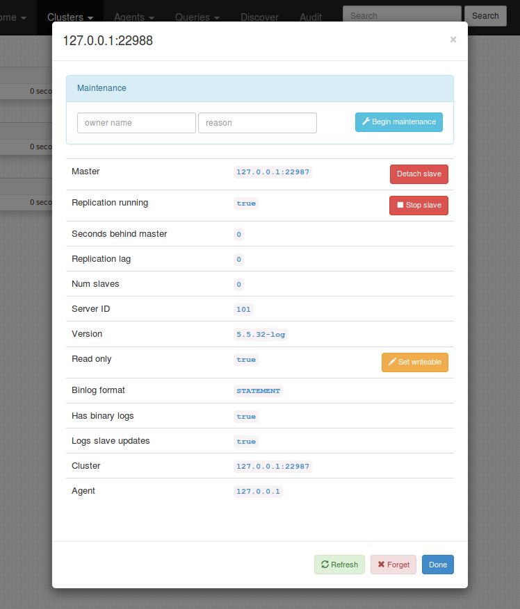

## About

_Orchestrator_ is a MySQL replication topology management and visualization tool, allowing for:

* Detection and interrogation of replication clusters
* Safe topology refactoring: moving slaves around the topology
* Sleek topology visualization
* Replication problems visualization
* Topology changes via intuitive drag & drop
* Maintenance mode declaration and enforcement
* Reviewing and killing long running queries
* Auditing of operations
* When working with [orchestrator-agent](https://github.com/outbrain/orchestrator-agent), seed new/corrupt instances
* More...

Refactoring the topology is a matter of a simple drag & drop. _Orchestrator_ will keep you safe by disallowing invalid replication topologies 
(e.g. replicating from ROW based to STATEMENT based, from 5.5 to 5.1 etc.)

_Orchestrator_ is developed at [Outbrain](http://www.outbrain.com/) to answer for the difficulty in managing replication topologies. 
At the time of _orchestrator_ creation GTID is available via MySQL 5.6 and MariaDB 10.0. And yet GTID is still not as mature as one would hope for. 
The majority of users still use plain-old binlog file:position based MySQL replication, and apparently this will hold for some time. 


#### TOC

- [About](#about)
- [License](#license)
- [Download](#download)
- [Requirements](#requirements)
- [Installation](#installation)
- [Execution](#execution)
- [Using the Web interface](#using-the-web-interface)
- [Using the web API](#using-the-web-api)
- [Security](#security)
- [Configuration](#configuration)
- [Supported topologies](#supported-topologies)
- [Agents](#agents)
- [Risks](#risks)
- [Gotchas](#gotchas)
- [Bugs](#bugs)
- [Contributions](#contributions)


## License
_Orchestrator_ is released as open source under the [Apache 2.0 license](http://www.apache.org/licenses/LICENSE-2.0)


## Download
_Orchestrator_ is released as open source and is available at [GitHub](https://github.com/outbrain/orchestrator). 
Find official releases in https://github.com/outbrain/orchestrator/releases

 
## Requirements
_Orchestrator_ is a standalone Go application. It requires a MySQL backend to store topologies state, maintenance status and audit history. 
It is built and tested on Linux 64bit, and binaries are availably for this OS type alone. The author has not tested any other operating system, 
though any other unix-like OS should do just fine.


## Installation
The following assumes you will be using the same machine for both the _orchestrator_ binary and the MySQL backend. 
If not, replace `127.0.0.1` with appropriate host name. Replace `orch_backend_password` with your own super secret password.


#### Setup backend MySQL server

Setup a MySQL server for backend, and invoke the following:

    CREATE DATABASE IF NOT EXISTS orchestrator;
    GRANT ALL PRIVILEGES ON `orchestrator`.* TO 'orchestrator'@'127.0.0.1' IDENTIFIED BY 'orch_backend_password';

_Orchestrator_ uses a configuration file, located in either `/etc/orchestrator.conf.json` or relative path to binary `conf/orchestrator.conf.json` or 
`orchestrator.conf.json`. Edit this file to match the above as follows:

    ...
    "MySQLOrchestratorHost": "127.0.0.1",
    "MySQLOrchestratorPort": 3306,
    "MySQLOrchestratorDatabase": "orchestrator",
    "MySQLOrchestratorUser": "orchestrator",
    "MySQLOrchestratorPassword": "orch_backend_password",
    ...


#### Grant access to orchestrator on all your MySQL servers
For _orchestrator_ to detect your replication topologies, it must also have an account on each and every topology. At this stage this has to be the 
same account (same user, same password) for all topologies. On each of your masters, issue the following:

    GRANT SUPER, PROCESS ON *.* TO 'orchestrator'@'orch_host' IDENTIFIED BY 'orch_topology_password';

Replace `orch_host` with hostname or orchestrator machine (or do your wildcards thing). Choose your password wisely. Edit `orchestrator.conf.json` to match:

    "MySQLTopologyUser": "orchestrator",
    "MySQLTopologyPassword": "orch_topology_password",


#### Extract orchestrator binary and files

- Extract from tarball

  Extract the archive you've downloaded from https://github.com/outbrain/orchestrator/releases
  For example, let's assume you wish to install _orchestrator_ under `/usr/local/orchestrator`:

      sudo mkdir -p /usr/local
      sudo cd /usr/local
      sudo tar xzfv orchestrator-1.0.tar.gz

- Install from `RPM`

  Installs onto `/usr/local/orchestrator`. Execute:
  
      sudo rpm -i orchestrator-1.0-1.x86_64.rpm


- Install from `DEB`

  Installs onto `/usr/local/orchestrator`. Execute:
  
      sudo dpkg -i orchestrator_1.0_amd64.deb
      
Consider moving `conf/orchestrator.conf.json` to `/etc/orchestrator.conf.json` (both locations are valid)      
    
To execute _orchestrator_ in command line mode or in HTTP API only, all you need is the `orchestrator` binary. 
To enjoy the rich web interface, including topology visualizations and drag-and-drop topology changes, you will need 
the `resources` directory and all that is underneath it. If you're unsure, don't touch; things are already in place.


## Execution


#### Executing as web/API service

Assuming you've installed _orchestrator_ under `/usr/local/orchestrator`:

    cd /usr/local/orchestrator && ./orchestrator http

_Orchestrator_ will start listening on port `3000`. Point your browser to `http://your.host:3000/` 
and you're ready to go. You may skip to next sections.
    
If you like your debug messages, issue:

    cd /usr/local/orchestrator && ./orchestrator --debug http
    
or, even more detailed in case of error:
    
    cd /usr/local/orchestrator && ./orchestrator --debug --stack http

The above looks for configuration in `/etc/orchestrator.conf.json`, `conf/orchestrator.conf.json`, `orchestrator.conf.json`, in that order.
Classic is to put configuration in `/etc/orchestrator.conf.json`. Since it contains credentials to your MySQL servers you may wish to limit access to that file. 
You may choose to use a different location for the configuration file, in which case execute:

    cd /usr/local/orchestrator && ./orchestrator --debug --config=/path/to/config.file http
 
Web/API service will, by default, issue a continuous, infinite polling of all known servers. This keeps _orchestrator_'s data up to date.
You typically want this behavior, but you may disable it, making _orchestrator_ just serve API/Web but never update the instances status:

    cd /usr/local/orchestrator && ./orchestrator --discovery=false http
    
The above is useful for development and testing purposes. You probably wish to keep to the defaults.


#### Executing as command line

Following is a synopsis of command line samples. For simplicitly, we assume `orchestrator` is in your path.
If not, replace `orchestrator` with `/path/to/orchestrator`.

> Samples below use a test `mysqlsandbox` topology, where all instances are on same host `127.0.0.1` and on different ports. `22987` is master, 
> and `22988`, `22989`, `22990` are slaves. 

Show currently known clusters (replication topologies):

    orchestrator -c clusters cli
    
> The above looks for configuration in `/etc/orchestrator.conf.json`, `conf/orchestrator.conf.json`, `orchestrator.conf.json`, in that order.
> Classic is to put configuration in `/etc/orchestrator.conf.json`. Since it contains credentials to your MySQL servers you may wish to limit access to that file.
 
You may choose to use a different location for the configuration file, in which case execute:

    orchestrator -c clusters --config=/path/to/config.file cli

> `-c` stands for `command`, and is mandatory.

Discover a new instance ("teach" _orchestrator_ about your topology). _Orchestrator_ will automatically recursively drill up the master chain (if any)
and down the slaves chain (if any) to detect the entire topology:

    orchestrator -c discover -i 127.0.0.1:22987 cli

> `-i` stands for `instance` and must be in the form `hostname:port`.

Do the same, and be more verbose:

    orchestrator -c discover -i 127.0.0.1:22987 --debug cli
    orchestrator -c discover -i 127.0.0.1:22987 --debug --stack cli

> `--debug` can be useful in all operations. `--stack` prints code stack trace on (most) errors and is useful
> for development & testing purposed or for submitting bug reports.

Forget an instance (an instance may be manually or automatically re-discovered via `discover` command above):

    orchestrator -c forget -i 127.0.0.1:22987 cli
    
Print an ASCII tree of topology instances. Pass a cluster name via `-i` (see `clusters` command above):

    orchestrator -c topology -i 127.0.0.1:22987 cli
    
> Sample output:
> 
>     127.0.0.1:22987
>     + 127.0.0.1:22989
>       + 127.0.0.1:22988
>     + 127.0.0.1:22990
        
Move a slave up the topology (make it sbling of its master, or direct slave of its "grandparent"):

    orchestrator -c move-up -i 127.0.0.1:22988 cli

> The above command will only succeed if the instance _has_ a grandparent, and does not have _problems_ such as slave lag etc.

Move a slave below its sibling:

    orchestrator -c move-below -i 127.0.0.1:22988 -s 127.0.0.1:22990 --debug cli

> `-s` stands for `sibling`.

> The above command will only succeed if `127.0.0.1:22988` and `127.0.0.1:22990` are siblings (slaves of same master), none of them has _problems_ (e.g. slave lag),
> and the sibling _can_ be master of instance (i.e. has binary logs, has `log_slave_updates`, no version collision etc.)
        
Promote a slave to be co-master with its master, making for a circular Master-Master topology:

    orchestrator -c make-co-master -i 127.0.0.1:22988 cli
    
> The above command will only succeed if `127.0.0.1:22988`'s master is root of topology (is not itself a slave)
> and is not associated in another co-master ring.

Detach a slave from its master, effectively breaking down the replication (destructive action):

    orchestrator -c detach-slave -i 127.0.0.1:22988 cli
    
> Although the above is destructive in temrs of replication chain, the only action taken is to modify
> the slave's `MASTER_PORT` to `65,535`. Otherwise it still retains the master's hostname and binary log
> positions. Assuming it is relatively easy to recall the original master's port, it is easy to recover
> from this destructive action.

> *A note on topology refactoring commands*
>
> `move-up`, `move-below`, `make-co-master` and `detach-slave` are the building blocks of topology refactoring. 
> With the first two actions one can make any change to the topology, with the exception of moving the master.
> The last two allow replacing a master by promoting one of its slaves to be a co-master (MySQL master-master
> replication), then detaching the newly promoted co-master from the original master, effectively making it the
> master of all topology. 

> These actions are also as atomic as possible, by only affecting two replication servers per action (e.g. `move-up` affects 
> the instance and its master; `move-below` affect the instance and its sibling). 

> _Orchestrator_ does not and will not support complex changes (like arbitrarily moving a slave to another position) 
> since this would require affecting multiple servers, increasing the chance for something to go wrong or for the
> total operation time to become prohibitively high without the DBA having a chance to get involved.
> Our experience is that by working out these atomic operations the DBA is more in control of potential problems.
> We also observed that it takes little extra time to initiate such multiple steps. 
        
Begin maintenance mode on an instance. While in maintenance mode, _orchestrator_ will not allow this instance to
be moved or participate in another instance's move:

    orchestrator -c begin-maintenance -i 127.0.0.1:22988 cli

End maintenance mode on an instance:

    orchestrator -c end-maintenance -i 127.0.0.1:22988 cli

Make an infinite, continuous discovery and investigation of known instances. Typically this is what the web service executes.

    orchestrator -c continuous --debug cli

Just check if an instance can be connected: attempt to resolve hostname and make a TCP connection to host & port:

    orchestrator -c resolve -i myhost.mydomain:3306

## Using the Web interface

The following assumes you have [Executed as web/API service](#executing-as-webapi-service). 
Open your browser and direct it at `http://your.host:3000`. If all went well, you should see
the following welcome page:


If this is your first time using _orchstrator_, then you should begin by teaching it. 
_orchestrator_ needs to know what replication topologies you have. The web interface 
provides this via the `discover` page.

From each replication topology, pick one server (this could be master or slave) and let
_orchestrator_ know which hostname & port this server listens on. _Orchestrator_ will
recursively drill up and down replication to map the entire topology. This may take a couple 
minutes, during which _orchestrator_ connects the servers it encounters into sub-topologies and
eventually into the final topology.

You may manually enter as many servers as you like (inside or outside the topology). 
The first time _orchestrator_ investigates, it can only reach those slaves that are
_currently replicating_. So if you know you have some slves which are temporarily down, you'll need
to add them manually, or, if you like to see automation in work, just wait until they're up, at which
time _orchestrator_ will automaticaly find them.

> Once _orchestrator_ is familiar with a server, it doesn't care if the server is lagging, not replicating
> or inaccessible. The server is still part of the topology it was last seen in. There is a timeout for
> that: if a server is not seen by `UnseenInstanceForgetHours` hours, it is automaticaaly forgotten
> (presumed dead). Again, if it suddenly comes back to life, and connects to a known topology, it is 
> automatically re-discovered.

_Orchestrator_ resolves the `CNAME` of every input it gets, either from the user or from the replication
topology itself. This is for avoiding ambiguities or implicit duplicates.


Once _orchestrator_ is familiar with a topology, you can view and manipulate it via the `cluster` page.
Click the `clusters` drop down on navigation bar to see available clusters.

> Each topology is associated with a _cluster name_, which is (currently) named after the topology's master.

The `cluster` page is where most fun happens. _Orchestrator_ presents the cluster in an easy to follow
tree infographic, based on a D3 widget. Sub trees are collapsible.

Each node in the tree presents a single MySQL instance, listing its fully qualified name, its version,
binary log format and replication lag.


Note that each server has a _settings_ icon to the right. Clicking this icon opens a modal with some
extra info on that server as well as operations to be performed.

The modal allows you to begin/terminate maintenance mode on an instance; perform an immediate refresh 
(by default instances are polled once per minute - this is configurable); stop/start replication; forget 
the instance (may be rediscovered a minute later if still connected to the topology). 



The topology can be refactored: slaves can be moved around via _drag and drop_. Start dragging an instance:
all possible _droppable_ targets are immediately colored green. You may turn your instance to be the slave of 
all _droppable_ targets.

Master-master topologies can be created by dragging a _master_ onto one of its slaves, making both co-masters.

Complex refactoring is done by performing multiple such steps. You may need to drag and drop your
instance three or four times to put it in a "remote" location.

_Orchestrator_ will keep you safe by disallowing dropping your instance when either your instance or its
target master have problems (lag too much, do not replicate etc.). It may allow the drop and still abort 
the operation if it finds a deeper block, such as the target not having binary logs.

Begin dragging: possible targets colored green


Move over your target and drop:


Topology refactored:


Dragging a master over its slave makes for a co-masters (master-master) topology:


A co-master topology:


_Orchestrator_ visually indicates replication & accessibility related problems: slave lag, replication not working, 
instance not accessed for long time, instance access failure, instance under maintenance.


_Problems_ drop down is available on all pages, and indicates all currently known issues across all topologies:


The `Audit` page presents with all actions taken via _orchestrator_: slave move, detection, maintenance etc.
(`START SLAVE` and `STOP SLAVE` are currently not audited).


`Queries` -> `Long queries` page list last met long running queries over the entire topology. these would be
queries running over `60` seconds, non-replication, non-event-scheduler.

## Using the web API

A keen web developer would notice (via Firebug or Developer Tools) how the web interface 
completely relies on JSON API requests. 

The JSON API provides with all the maintenance functionality you can find in the web interface or the 
command line mode.

> Most users will not be interested in accessing the API. If you're unsure: you don't need it.
> For creators of frameworks and maintenance tools, it may provide with great powers (and great responsibility).

The following is a brief listing of the web API exposed by _orchestrator_:

* `/api/instance/:host/:port`: reads and returns an instance's details (example `/api/instance/mysql10/3306`)
* `/api/discover/:host/:port`: discover given instance and all the topology it is associated with (example `/api/discover/mysql10/3306`)
* `/api/refresh/:host/:port`: synchronously re-read instance status 
* `/api/forget/:host/:port`: remove records of this instance. It may be automatically rediscovered by 
  following up on its master or one of its slaves.
* `/api/resolve/:host/:port`: check if hostname resolves and whether TCP connection can be established (example: `/api/resolve/myhost.mydomain/3306`)  
* `/api/move-up/:host/:port` (attempt to) move this instance up the topology (make it child of its grandparent)
* `/api/move-below/:host/:port/:siblingHost/:siblingPort` (attempt to) move an instance below its sibling.
  the two provided instances must be siblings: slaves of the same master. (example `/api/move-below/mysql10/3306/mysql24/3306`)
* `/api/make-co-master/:host/:port` (attempt to) make this instance co-master with its own master, creating a
  circular master-master topology.
* `/api/detach-slave/:host/:port` (attempt to) detach a slave from its master, breaking replication (destructive operation)
* `/api/begin-maintenance/:host/:port/:owner/:reason`: declares and begins maintenance mode for an instance.
  While in maintenance mode, _orchestrator_ will not allow moving this instance. 
  (example `/api/begin-maintenance/mysql10/3306/gromit/upgrading+mysql+version`)
* `/api/end-maintenance/:host/:port`: end maintenance on instance
* `/api/end-maintenance/:maintenanceKey` end maintenance on instance, based on maintenance key given on `begin-maintenance` 
* `/api/start-slave/:host/:port`: issue a `START SLAVE` on an instance 
* `/api/stop-slave/:host/:port`: issue a `STOP SLAVE` on an instance
* `/api/set-read-only/:host/:port`: issue a `SET GLOBAL read_only := 1` on an instance
* `/api/set-writeable/:host/:port`: issue a `SET GLOBAL read_only := 0` on an instance
* `/api/kill-query/:host/:port/:process`: kill a query (denoted by process id) on given instance. Synchronous call. 
* `/api/maintenance`: list instances in active maintenance mode
* `/api/cluster/:clusterName`: list instances in a topology cluster. Each topology is automatically given a unique 
  name. At this point the name is set by the topology's master (and if there's a master-master setup, then one of the masters).
  For example, a topology's name might be `mysql10:3306`, based on the understanding the server `mysql10` on port `3306`
  is the master of the topology.  
* `/api/clusters`: list names of known topologies. 
* `/api/clusters-info`: list known clusters (topologies) and basic info
* `/api/search/:searchString`: list instances matching search string
* `/api/problems`: list instances who have known problems (e.g. not replicating, lagging etc.) 
* `/api/long-queries`: list of long running queries on all topologies (queries running for over 60 seconds, excluding replication and event-scheduler queries)
* `/api/long-queries/:filter`: list of long running queries on all topologies, filtered by text match
* `/api/audit`: show most recent audit entries
* `/api/audit/:page`: show latest audit entries, paginated (example: `/api/audit/3` for 3rd page)  


#### Instance JSON breakdown

Many API calls return _instance objects_, describing a single MySQL server. 
This sample is followed by a field breakdown:

```json
{
    "Key": {
        "Hostname": "127.0.0.1",
        "Port": 22988
    },
    "ServerID": 101,
    "Version": "5.5.32-log",
    "ReadOnly": false,
    "Binlog_format": "STATEMENT",
    "LogBinEnabled": true,
    "LogSlaveUpdatesEnabled": true,
    "SelfBinlogCoordinates": {
        "LogFile": "mysql-bin.000016",
        "LogPos": 10930
    },
    "MasterKey": {
        "Hostname": "127.0.0.1",
        "Port": 22987
    },
    "Slave_SQL_Running": true,
    "Slave_IO_Running": true,
    "ReadBinlogCoordinates": {
        "LogFile": "mysql-bin.000030",
        "LogPos": 10995
    },
    "ExecBinlogCoordinates": {
        "LogFile": "mysql-bin.000030",
        "LogPos": 10995
    },
    "SecondsBehindMaster": {
        "Int64": 0,
        "Valid": true
    },
    "SlaveLagSeconds": {
        "Int64": 0,
        "Valid": true
    },
    "SlaveHosts": [
        {
            "Hostname": "127.0.0.1",
            "Port": 22990
        },
        {
            "Hostname": "127.0.0.1",
            "Port": 22989
        }
    ],
    "ClusterName": "127.0.0.1:22987",
    "IsLastCheckValid": true,
    "IsUpToDate": true,
    "IsRecentlyChecked": true,
    "SecondsSinceLastSeen": {
        "Int64": 8,
        "Valid": true
    },
    "CountMySQLSnapshots": 0
}
```

* `Key`: unique indicator for the instance: a combination of host & port
* `ServerID`: the MySQL `server_id` param
* `Version`: MySQL version
* `ReadOnly`: the global `read_only` boolean value
* `Binlog_format`: the global `binlog_format` MySQL param
* `LogBinEnabled`: whether binary logs are enabled 
* `LogSlaveUpdatesEnabled`:  whether `log_slave_updates` MySQL param is enabled
* `SelfBinlogCoordinates`: binary log file & position this instance write to (as in `SHOW MASTER STATUS`)
* `MasterKey`: hostname & port of master, if any
* `Slave_SQL_Running`: direct mapping from `SHOW SLAVE STATUS`'s `Slave_SQL_Running` 
* `Slave_IO_Running`: direct mapping from `SHOW SLAVE STATUS`'s `Slave_IO_Running`
* `ReadBinlogCoordinates`: (when replicating) the coordinates being read from the master (what `IO_THREAD` polls)
* `ExecBinlogCoordinates`: (when replicating) the master's coordinates that are being executed right now (what `SQL_THREAD` executed)
* `SecondsBehindMaster`: direct mapping from `SHOW SLAVE STATUS`'s `Seconds_Behind_Master`
    `"Valid": false` indicates a `NULL`
* `SlaveLagSeconds`: when `SlaveLagQuery` provided, the computed slave lag; otherwise same as `SecondsBehindMaster`
* `SlaveHosts`: list of MySQL slaves *hostname & port)
* `ClusterName`: name of cluster this instance is associated with; uniquely identifies cluster
* `IsLastCheckValid`: whether last attempt at reading this instane succeeeded
* `IsUpToDate`: whether this data is up to date
* `IsRecentlyChecked`: whether a read attempt on this instance has been recently made
* `SecondsSinceLastSeen`: time elapsed since last successfully accessed this instance
* `CountMySQLSnapshots`: number of known snapshots (data provided by `orchestrator-agent`)
 
 
## Security

When operating in HTTP mode (API or Web), access to _orchestrator_ may be restricted via either:

*  _basic authentication_

   Add the following to _orchestrator_'s configuration file:

        "AuthenticationMethod": "basic",
        "HTTPAuthUser":         "dba_team",
        "HTTPAuthPassword":     "time_for_dinner"

   With `basic` authentication there's just one single credential, and no roles.

   _Orchestrator_'s configuration file contains credentials to your MySQL servers as well as _basic authentication_
   credentials as specified above. Keep it safe (e.g. `chmod 600`).

*  _Headers authentication_
   
   Authenticates via headers forwarded by reverse proxy (e.g. Apache2 relaying requests to orchestrator).
   Requires:
   
        "AuthenticationMethod": "proxy",
        "AuthUserHeader": "X-Forwarded-User",
   
   You will need to configure your reverse proxy to send the naem of authenticated user via HTTP header, and
   use same header name as configured by `AuthUserHeader`.
   
   For example, an Apache2 setup may look like the following:
   
        RequestHeader unset X-Forwarded-User
        RewriteEngine On
        RewriteCond %{LA-U:REMOTE_USER} (.+)
        RewriteRule .* - [E=RU:%1,NS]
        RequestHeader set X-Forwarded-User %{RU}e
   
   The `proxy` authentication allows for *roles*. Soem users are *Power users* and the rest are just normal users.
   *Power users* are allowed to make changes to the topologies, whereas normal users are in read-only mode.
   To specify the list of known DBAs, use:

        "PowerAuthUsers": [
            "wallace", "gromit", "shaun"
            ],
   

## Configuration

The following is a complete list of configuration parameters:

* `ListenAddress`           (string), host & port to listen on (default `":3000"`). You can limit connections to local machine via `"127.0.0.1:3000"`
* `MySQLTopologyUser`       (string), credentials for replication topology servers (masters & slaves)          
* `MySQLTopologyPassword`   (string), credentials for replication topology servers (masters & slaves)
* `MySQLOrchestratorHost`   (string), hostname for backend MySQL server
* `MySQLOrchestratorPort`   (uint), port for backend MySQL server
* `MySQLOrchestratorDatabase`   (string), name of backend MySQL server schema
* `MySQLOrchestratorUser`       (string), credentials for backend MySQL server
* `MySQLOrchestratorPassword`   (string), credentials for backend MySQL server
* `SlaveLagQuery`               (string), custom query to check on slave lg (e.g. heartbeat table). If unprovided,
  slave's `Seconds_Behind_Master` is used.
* `SlaveStartPostWaitMilliseconds`  (int), Time to wait after `START SLAVE` before re-reading instance (give slave chance to connect to master)
* `DiscoverByShowSlaveHosts`    (bool), Attempt `SHOW SLAVE HOSTS` before `SHOW PROCESSLIST`
* `InstancePollSeconds`         (uint), Number of seconds between instance reads
* `UnseenInstanceForgetHours`   (uint), Number of hours after which an unseen instance is forgotten
* `DiscoveryPollSeconds`        (int), Auto/continuous discovery of instances sleep time between polls
* `ReasonableReplicationLagSeconds` (int), Above this value is considered a problem
* `ReasonableMaintenanceReplicationLagSeconds` (int), Above this value move-up and move-below are blocked
* `AuditPageSize`       (int), Number of entries in an audit page
* `AuthenticationMethod`    (string), type of authentication. Either empty (no authentication, default), `"basic"` or `"proxy"`. See [Security](#security) section.
* `AuthUserHeader`          (string), name of HTTP header which contains authenticated user when `AuthenticationMethod` is `"proxy"`
* `PowerAuthUsers`          (string list), users considered as *power users* (allowed to manipulate the topology); applies on `"proxy"` `AuthenticationMethod`. 
* `HTTPAuthUser`        (string), Username for HTTP Basic authentication (blank disables authentication)
* `HTTPAuthPassword`    (string), Password for HTTP Basic authentication
* `ClusterNameToAlias`  (string-to-string map), Map between regex matching cluster name to a human friendly alias. 
  The human friendly alias is then presented on the `Clusters` menu and in the `Clusters Dashboard` page.
* `ServeAgentsHttp`     (bool), should *orchestrator* accept agent registrations and serve agent-related requests (see [Agents](#agents))
* `AgentsUseSSL`        (bool), if `true`, agents service runs HTTPS and also connects to agents via HTTPS
* `SSLPrivateKeyFile`   (string), SSL private key file used for agents service. Aonly applies on `ServeAgentsHttp` = `true` and `AgentsUseSSL` = `true` 
* `SSLCertFile`         (string), SSL certification file used for agents service. Aonly applies on `ServeAgentsHttp` = `true` and `AgentsUseSSL` = `true` 
* `AgentPollMinutes`     (uint), interval at which *orchestrator* contacts agents for brief status update
* `UnseenAgentForgetHours`     (uint), time without contact after which an agent is forgotten 
* `StaleSeedFailMinutes`     (uint), time after which a seed with no state update is considered to be failed

See [sample config file](https://github.com/outbrain/orchestrator/blob/master/conf/orchestrator.conf.json) in master branch.


## Supported topologies

_Orchestrator_ supports "standard" MySQL replication. The standard replication is the type of replication present in 
MySQL up to and including version **5.5**. The following are *not* supported:
* GTID
* Parallel replication
* Multi-master replication (as in MariaDB **10.0**)
* Tungsten replication

Master-master (ring) replication is supported for two master nodes. Topologies of three master nodes or more in a ring are unsupported.

Galera/XtraDB Cluster replication is not strictly supported: _orchestrator_ will not recognize that co-masters
in a Galera topology are related. Each such master would appear to _orchestrator_ to be the head of its own distinct 
topology.

Replication topologies with multiple MySQL instances on the same host are supported. For example, the testing
environment for _orchestrator_ is composed of four instances all running on the same machine, courtesy MySQLSandbox.
However, MySQL's lack of information sharing between slaves and masters make it impossible for _orchestrator_ to
analyze the topology top-to-bottom, since a master does not know which ports its slaves are listening on.
The default assumption is that slaves are listening on same port as their master. With multiple instances on a single
machine (and on same network) this is impossible. In such case you must configure your MySQL instances' 
`report_host` and `report_port` ([read more](http://code.openark.org/blog/mysql/the-importance-of-report_host-report_port)) 
parameters, and set _orchestrator_'s configuration parameter `DiscoverByShowSlaveHosts` to `true`.   


## Agents

You may optionally install [orchestrator-agent](https://github.com/outbrain/orchestrator-agent) on your MySQL hosts.
*orchestrator-agent* is a service which registers with your *orchestrator* server and accepts requests by *orchestrator*
via web API.

Supported requests relate to general, OS and LVM operations, such as:
- Stopping/starting MySQL service on host
- Getting MySQL OS info such as data directory, port, disk space usage
- Performing various LVM operations such as finding LVM snapshots, mounting/unmounting a snapshot
- Transferring data between hosts (e.g. via `netcat`)

`orchestrator-agent` is developed at [Outbrain](https://github.com/outbrain) for Outbrain's specific requirements, and is
less of a general solution. As such, it supports those operations required by Outbrain's architecture. For example, we
rely on LVM snapshots for backups; we use a directory service to register available snapshots; we are DC-aware and prefer
local backups over remote backups.

Nevertheless at the very least `orchestrator-agent` should appeal to most. It is configurable to some extent (directory
service command is configurable - write your own bash code; data transfer command is configurable - replace `netcat` with 
your own prefered method, etc.).

The information and API exposed by *orchestrator-agent* to *orchestrator* allow *orchestrator* to coordinate and operate
seeding of new or corrupted machines by getting data from freshly available snapshots. Moreover, it allows *orchestrator*
to automatically suggest the source of data for a given MySQL machine, by looking up such hosts that actually have a 
recent snapshot available, preferably in the same datacenter.
  
For security measures, an agent requires a token to operate all but the simplest requests. This token is randomly generated
by the agent and negotiated with *orchestrator*. *Orchestrator* does not expose the agent's token (right now some work
needs to be done on obscurring the token on error messages).

## Risks

Most of the time _orchestrator_ only reads status from your topologies. Default configuration is to poll each instance once per minute.
This is very relaxed, and you can go way more intensive than that. But do be aware that _orchestrator_ opens connections to all your servers
(and typically reuses them).

Actual risk begins when you modify instances. Namely moving slaves around the topology. _Orchestrator_ does its best to:

1. Make sure you only move an instance to a location where it is valid for it to replicate (e.g. that you don't put a 5.5 server below a 5.6 server)
2. Make sure you move an instance at the right time (ie the instance and whicever affected servers are not lagging badly, so that operation can compeltely in a timely manner).
3. Do the math correctly: stop the slave at the right time, roll it forward to the right position, `CHANGE MASTER` to the correct location & position.

All the above is tested, and have been put to practice in our production topologies. We have not witnessed a miscalculation or misprotection throughout our production use.

When _orchestrator_ encounters an error throughout the moving process, it does its best to rollback. However extreme cases such as a new master crashing in the middle of the move
may leave the topology unstable (though the same instance could crash before the move and leave whatever topology it was in charge of unstable just as well). 
Or someone manually tampering with replication even while _orchestrator_ is moving the slave around. Point being - weird
and evil stuff can happen, and there is a risk in a slave losing its position vs. its master.

Now that you're a bit more scared, it's time to reflect: how much did your hands tremble when you navigated your slaves _by hand_ up and down through the topology? 
We suspect the automation provided by _orchestrator_ makes for a _safer_ management mechanism than we get with our shaking hands.

Also, read the [LICENSE](https://github.com/outbrain/orchestrator/blob/master/LICENSE), and especially the "WITHOUT WARRANTIES OR CONDITIONS OF ANY KIND" part.
 

## Gotchas

* By default, _orchestrator_ only polls a server once a minute (configurable via `InstancePollSeconds`). This means that any
status you see is essentially an estimation. Different instances get polled at different times. The status you see on the
_cluster_ page, for example, does not necessarily reflect a given point in time, but rather a combination of different points
in time in the last minute (or whatever poll interval you use).

  The `problems` drop down to the right is also executed asynchonously. You may therefore see the same instance in two
  places (once in the `cluster` page, once in the `problems` drop down) in two different states.

  If you want to get the most up to date instance status, use the "Refresh" button on the instance's _settings dialog_.  

* Similarly, on `Long Queries` page the queries presented are true to a point in time in the last minute (or otherwise the
`InstancePollSeconds` settgins). Thus, it is possible that by the time you look at this page, the queries listed will have been
completed. If you choose to click the `Kill query` button, please be advised that you might actually be killing a *different*
query, executing on same connection following up on the by-now-completed listed long running query.
  
* It make take a couple minutes for _orchestrator_ to full detect a cluster's topology. The time depends on the depth
of the topology (if you have slaves-of-slaves the time increases). This is due to the fact _orchestrator_ polls the instances
independently, and and insight on the topology must propagate from master to slave on the next polling occasion.

* Specifically, if you fail over to a new master, you may find that for a couple minutes the topologies seem empty.
This may happen because instances used to identify themselves as belonging to a certain topology that is now being destroyed.
This is self-healing. Refresh and look at the `Clusters` menu to review the newly created cluster (names after the new master)
over time.

* Don't restart _orchestrator_ while you're running a seed (only applies to workingwith _orchestrator-agent_)

  Otherwise _orchestrator_ is non-intrusive and self-healing. You can restart it whenever you like.

## Bugs

Please report bugs on the [Issues page](https://github.com/outbrain/orchestrator/issues)


## Contributions

Yes, please. All contributions must be licensed under the 
[Apache 2.0 license](http://www.apache.org/licenses/LICENSE-2.0) or compatible.

